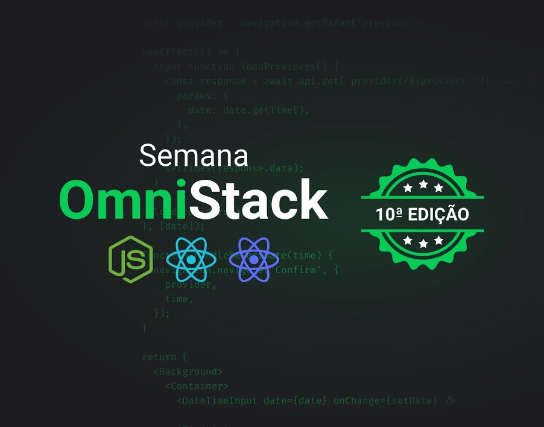

</img>
<h1 align="center">Semana Omnistack 10</h1>

Projeto <strong>DevRadar</strong> desenvolvido durante a Omnistack da <a href="https://rocketseat.com.br">Rocketseat</a> 🚀👩🏽‍🚀

  <a aria-label="Versão do Node" href="https://github.com/nodejs/node/blob/master/doc/changelogs/CHANGELOG_V12.md#12.14.1">
    </img>
  </a>
  <a aria-label="Versão do React" href="https://github.com/facebook/react/blob/master/CHANGELOG.md#16120-november-14-2019">
    </img>
  </a>

  <a href="#-instalacao-e-execução">Instalação e execução</a>&nbsp;&nbsp;&nbsp;|&nbsp;&nbsp;&nbsp;
  <a href="#-como-contribuir">Como contribuir</a>&nbsp;&nbsp;&nbsp;|&nbsp;&nbsp;&nbsp;
  <a href="#memo-licença">Licença</a>

## 🚀 Instalação e execução

_ps: Se precisar de ajuda para fazer um clone, esse [tutorial aqui](https://help.github.com/pt/github/creating-cloning-and-archiving-repositories/cloning-a-repository) vai te ajudar 💖_

1. Abra o terminal do seu computador. Se estiver no Windows pode ser o CMD ou Powershell.
2. Altere o diretório de trabalho atual para o local em que deseja ter o código do módulo salvo no seu computador.
3. Faça um clone desse repositório rodando:   `git clone https://github.com/maykbrito/omnistack10.git`;
4. Entre na pasta rodando pelo terminal: `cd omnistack10`;
5. Rode `yarn` para instalar as dependências do projeto;
6. Rode `yarn dev` para iniciar o servidor de desenvolvimento.

## 🤔 Como contribuir

Se quiser contribuir para esse repositório aqui, seja corrigindo algum problema, adicionando comentários ou melhorando a documentação, você pode seguir esse tutorial abaixo:

- Faça [um fork](https://help.github.com/pt/github/getting-started-with-github/fork-a-repo) desse repositório;
- Entre no seu perfil no GitHub e faça um clone do repositório que você fez um fork;
- Cria uma branch com a sua alteração: `git checkout -b minha-alteracao`;
- Faça as alterações necessárias no código ou documentação;
- Faça commit das suas alterações: `git commit -m 'feat: Minha nova feature'`;
- Faça push para a sua branch: `git push origin minha-alteracao`;
- Agora é só abrir a sua Pull Request no repositório que você fez o fork;

Depois que o merge da sua pull request for feito, você pode deletar a sua branch.

## :memo: Licença

Esse projeto está sob a licença MIT. Veja o arquivo [LICENSE](LICENSE.md) para mais detalhes.

---

Feito com ♥ by Rocketseat :wave: [Entre na nossa comunidade!](https://discordapp.com/invite/gCRAFhc)
